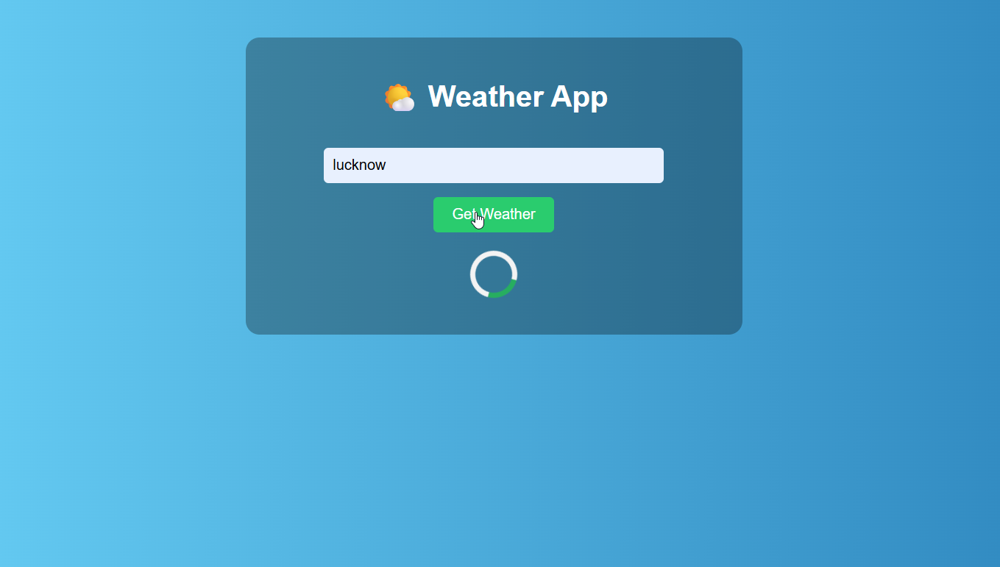
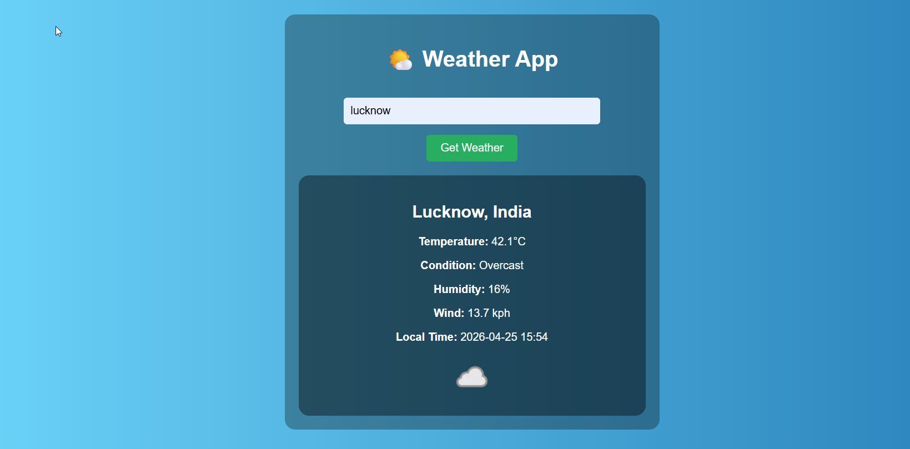

# 🌤️ WEATHERLY — Modern Weather App

A clean, fast, and responsive **Weather Web App** built using **HTML, CSS, and JavaScript**.  
Get real-time weather updates for any city with a smooth UI and instant results.

---

## Features

### Core Features

* Search weather by city name  
* Real-time weather data  
* Temperature in Celsius  
* Weather condition display  
* Humidity and wind speed  
* Local time of the city  

---

### Smart Features

* Instant search with Enter key  
* Loading spinner while fetching data  
* Error handling (invalid city / network issues)  
* Dynamic weather icons  
* Smooth fade-in animation  

---

###  UI Highlights

* Gradient background design  
* Centered glassmorphism-style card  
* Clean and minimal layout  
* Fast and responsive interface  

---

## Tech Stack

* HTML5  
* CSS3 (Animations + Gradient UI)  
* JavaScript (DOM + Fetch API)  
* Weather API  

---

## Project Structure

weather-app/
│── index.html
│── style.css
│── script.js
│── fav-icon.svg
│── README.md

---

## Getting Started

### Clone the repository
git clone https://github.com/deveshgi/weather-app.git

### Open project
cd weather-app

### Run
Simply open **index.html** in your browser

---

## 🔑 API Setup

### This project uses WeatherAPI.

👉 Get your free API key from: https://www.weatherapi.com/

Replace this line in **script.js:**

const apiKey = "YOUR_API_KEY";

---

## Preview

### Main UI
Clean and minimal weather interface

### Loading State
Spinner animation while fetching data

### Weather Result
Detailed weather info with icon

---

## Important Notes
* API key is exposed (for demo purposes only)
* Requires internet connection
* Enter correct city names for best results

---

## Future Improvements
* Auto-detect location (Geolocation API)
* Dark mode toggle
* 7-day weather forecast
* Multi-language support
* Mobile app version

---

## What I Learned
* Fetch API & handling async data
* DOM manipulation
* Error handling in JavaScript
* UI/UX design basics
* Working with external APIs

---

## Author

Devesh Kumar

GitHub: https://github.com/deveshgi

---

## Support

If you like this project:

👉 Give it a star ⭐
👉 Share it with others

---

## Goal

This project is built to:

* Practice real-world API integration 
* Improve frontend skills 
* Build useful web applications 

---

## "Small projects build big skills."

---